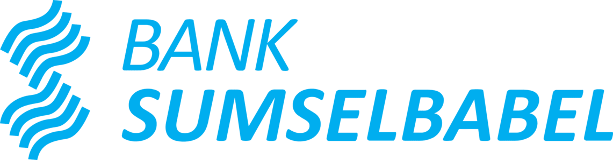

# Sistem Monitoring Mesin EDC

<div align="center">
  
  
  <h3>Sistem Monitoring Mesin EDC Bank Sumsel Babel</h3>
  <p>Sistem monitoring berbasis web yang komprehensif untuk mengelola mesin EDC, tracking rental, dan monitoring maintenance.</p>
</div>

---

## Daftar Isi

- [Fitur](#-fitur)
- [Tech Stack](#-tech-stack)
- [Prasyarat](#-prasyarat)
- [Instalasi](#-instalasi)
- [Penggunaan](#-penggunaan)
- [Struktur Project](#-struktur-project)

---

## Fitur

### Dashboard & Analytics
- **Statistik Real-time** - Total mesin, mesin terdaftar bank, monitoring terlambat
- **Visual Analytics** - Bar chart (status data) dan pie chart (status mesin)
- **Alert Mesin Baru** - Tracking registrasi vendor baru
- **Monitoring Terlambat** - Tracking maintenance berbasis prioritas

### Manajemen Mesin (Rekap)
- **Inventori Lengkap** - Katalog mesin lengkap dengan search & filter
- **Import Massal** - Import Excel untuk data vendor dan bank
- **Export Laporan** - Export PDF/Excel dengan filter berdasarkan tahun
- **Tracking Status** - Update status mesin secara real-time

### Sistem Overdue
- **Peringatan Cerdas** - Peringatan 3 hari sebelum deadline maintenance
- **Kalkulasi Kerugian Otomatis** - Dampak finansial per bulan terlambat
- **Sorting Prioritas** - OVERDUE → WARNING → PERBAIKAN
- **Search & Filter** - Berdasarkan cabang, lokasi, tahun, dan status

### Manajemen Rental (Sewa)
- **Tracking Aktif/Expired** - Monitoring status rental
- **Monitoring Biaya** - Kalkulasi biaya sewa bulanan
- **Deteksi Problematik** - Alert untuk mesin dalam perbaikan dengan rental aktif
- **Dashboard Finansial** - Ringkasan total biaya sewa bulanan

### Import/Export Data
- **Import Excel** - Dukungan format Excel vendor dan bank
- **Validasi Cerdas** - Validasi dan normalisasi data otomatis
- **Deteksi Duplikat** - Mencegah entri data duplikat
- **Export Berbasis Tahun** - Filter export berdasarkan tahun instalasi

---

## Tech Stack

### Frontend

| Teknologi | Kegunaan |
|-----------|----------|
| **React 19** | UI library untuk membangun interface interaktif |
| **Vite** | Build tool dan development server yang cepat |
| **React Router v7** | Client-side routing dan navigasi |
| **Tailwind CSS** | Utility-first CSS framework untuk styling |
| **shadcn/ui** | Komponen UI yang sudah jadi dan accessible (Radix UI) |
| **Recharts** | Visualisasi data dan chart |
| **Lucide React** | Library icon modern |
| **React Hot Toast** | Notifikasi toast |
| **jsPDF** | Generate PDF untuk laporan |
| **Axios** | HTTP client untuk request API |

### Backend

| Teknologi | Kegunaan |
|-----------|----------|
| **Go 1.21+** | Bahasa backend dengan performa tinggi |
| **Fiber v2** | Web framework untuk Go yang terinspirasi Express |
| **GORM** | ORM library untuk operasi database |
| **MySQL 8.0** | Relational database untuk penyimpanan data |
| **Excelize** | Pembacaan dan pemrosesan file Excel |
| **Air** | Live reload untuk aplikasi Go (development) |

### Development Tools

| Tool | Kegunaan |
|------|----------|
| **Git** | Version control system |
| **Laragon** | Local development environment (MySQL, Apache) |
| **Postman** | Testing dan dokumentasi API |
| **VS Code** | Code editor dengan ekstensi Go/React |

---

## Prasyarat

Sebelum instalasi, pastikan Anda memiliki:

- **Node.js** v18 atau lebih baru ([Download](https://nodejs.org/))
- **Go** 1.21 atau lebih baru ([Download](https://go.dev/dl/))
- **Laragon** atau MySQL 8.0+ ([Download Laragon](https://laragon.org/download/))
- **Git** ([Download](https://git-scm.com/downloads))

---

## Instalasi

### 1. Clone Repository
```bash
git clone https://github.com/your-username/EDC-Monitoring-System.git
cd EDC-Monitoring-System
```

### 2. Install Dependencies Frontend
```bash
cd Frontend
npm i
```

### 3. Install Dependencies Backend
```bash
cd ../backend
go mod tidy
```

### 4. Setup Environment Variables

**Backend (.env)**
```bash
cd backend
```

Buat file `.env`:
```env
DB_HOST=localhost
DB_PORT=3306
DB_USER=root
DB_PASS=
DB_NAME=edc_monitoring
```

**Frontend (.env)**
```bash
cd ../Frontend
```

Buat file `.env`:
```env
VITE_BASE_URL=http://localhost:3000/
```

### 5. Setup Database

**Jalankan Laragon:**
1. Buka Laragon
2. Klik **Start All**
3. Verifikasi MySQL sudah berjalan

**Import Database:**
```bash
# Buka Laragon Terminal atau MySQL CLI
mysql -u root -p

# Buat database
CREATE DATABASE edc_monitoring;

# Keluar dari MySQL
exit;

# Import file SQL
mysql -u root -p edc_monitoring < path/to/edc_monitoring.sql
```

### 6. Jalankan Aplikasi

**Terminal 1 - Backend:**
```bash
cd backend
go run main.go
```
Backend berjalan di: `http://localhost:3000`

**Terminal 2 - Frontend:**
```bash
cd Frontend
npm run dev
```
Frontend berjalan di: `http://localhost:5173`

---

## Penggunaan

### Kredensial Login
```
Username: admin
Password: admin123
```

### Akses Aplikasi

Buka browser dan kunjungi: `http://localhost:5173`

### Demo Fitur

#### 1. Dashboard Overview
- Lihat total mesin, mesin terdaftar bank, jumlah terlambat
- Explore bar chart (status data) dan pie chart (status mesin)
- Cek mesin baru dari vendor
- Monitor mesin terlambat

#### 2. Manajemen Mesin (Rekap)
**Tambah Mesin Satuan:**
1. Klik tombol **Tambah Rekap**
2. Pilih tab **Rekap Satuan**
3. Isi: Terminal ID, MID, Lokasi, Cabang, Tipe EDC
4. Klik **Tambah Mesin**

**Import dari Excel:**
1. Klik tombol **Tambah Rekap**
2. Pilih tab **Multi Rekap (Excel)**
3. Pilih sumber data **Vendor** atau **Bank**
4. Upload file Excel
5. Klik **Upload Data**

**Export Data:**
1. Terapkan filter (status, cabang, tahun)
2. Klik tombol **PDF** atau **Excel**
3. Pilih tahun untuk di-export
4. Klik **Export**

#### 3. Monitoring Overdue
- Lihat mesin yang melebihi estimasi maintenance
- Cek warning (≤3 hari sebelum deadline)
- Monitor kalkulasi kerugian finansial
- Filter berdasarkan status perbaikan, cabang, lokasi, tahun

#### 4. Manajemen Rental (Sewa)
- Tracking rental aktif vs expired
- Monitor biaya sewa bulanan
- Deteksi mesin problematik (rental aktif + perbaikan)
- Export laporan rental

#### 5. Detail Mesin
1. Klik pada baris mesin
2. Lihat informasi lengkap mesin
3. Klik **Edit Data** untuk update
4. Simpan perubahan

---

## Struktur Project
```
EDC-Monitoring-System/
├── Frontend/                 # Aplikasi React
│   ├── src/
│   │   ├── components/      # Komponen React
│   │   │   ├── auth/       # Komponen login
│   │   │   ├── chart/      # Komponen chart
│   │   │   ├── common/     # Komponen yang dapat digunakan ulang
│   │   │   ├── layout/     # Komponen layout
│   │   │   ├── modal/      # Komponen modal
│   │   │   ├── table/      # Komponen table
│   │   │   └── ui/         # Komponen shadcn/ui
│   │   ├── context/        # React Context (Auth)
│   │   ├── hooks/          # Custom React hooks
│   │   ├── pages/          # Komponen halaman
│   │   ├── routes/         # Proteksi route
│   │   ├── service/        # Layer service API
│   │   ├── utils/          # Fungsi utility
│   │   ├── App.jsx         # Root component
│   │   └── main.jsx        # Entry point
│   ├── public/             # Asset statis
│   └── package.json
│
├── backend/                 # Aplikasi Go Fiber
│   ├── config/             # Konfigurasi
│   ├── controllers/        # Request handlers
│   ├── database/           # Koneksi database
│   ├── middlewares/        # Auth middleware
│   ├── models/             # Model data
│   │   ├── dto/           # Data Transfer Objects
│   │   ├── mesin_edc.go   # Model mesin
│   │   ├── perbaikan.go   # Model maintenance
│   │   └── sewa.go        # Model rental
│   ├── routes/             # Route API
│   ├── utils/              # Fungsi helper
│   ├── .env               # Environment variables
│   ├── go.mod             # Dependencies Go
│   └── main.go            # Entry point
│
├── edc_monitoring.sql      # Sample database
└── README.md
```

---

## Format Import Excel

### Format Excel Vendor
| Kolom | Nama Field |
|-------|------------|
| A | NO |
| B | TID (Terminal ID) |
| C | MID |
| D | NO SPK |
| E | DEFAULT_MCC |
| F | DESCRIPTION |
| G | KOTA |
| H | CABANG PENGELOLA |
| I | TYPE EDC |

### Format Excel Bank
| Kolom | Nama Field |
|-------|------------|
| A | NO |
| B | TERMINAL_ID_NR |
| C | STATUS |
| D | OWNER_ENTITY_ID |
| E | ENTITY_NAME |
| F | ACTUAL_START_TIME |
| G | ENTITY_STATUS |

---
## License

Proprietary - Bank Sumsel Babel © 2026

---